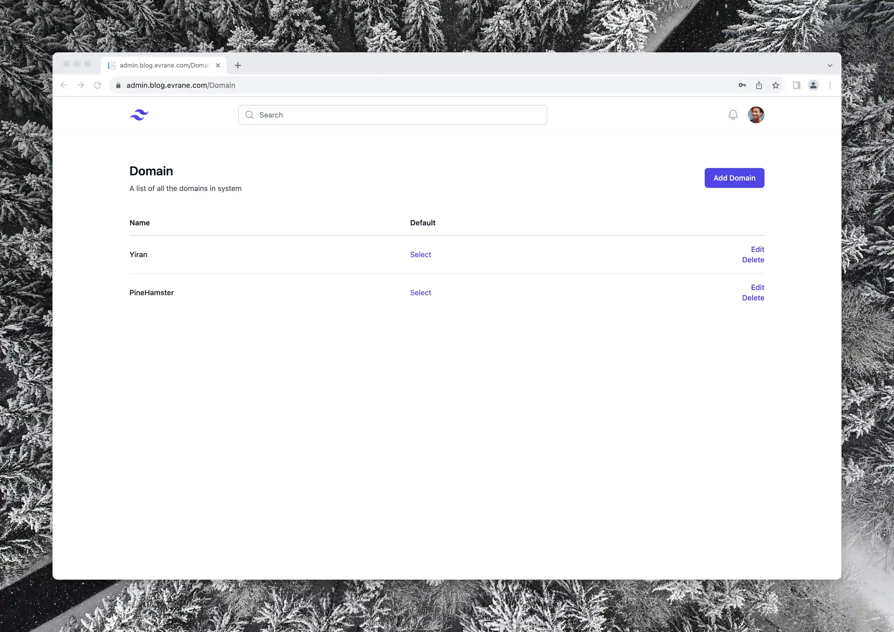
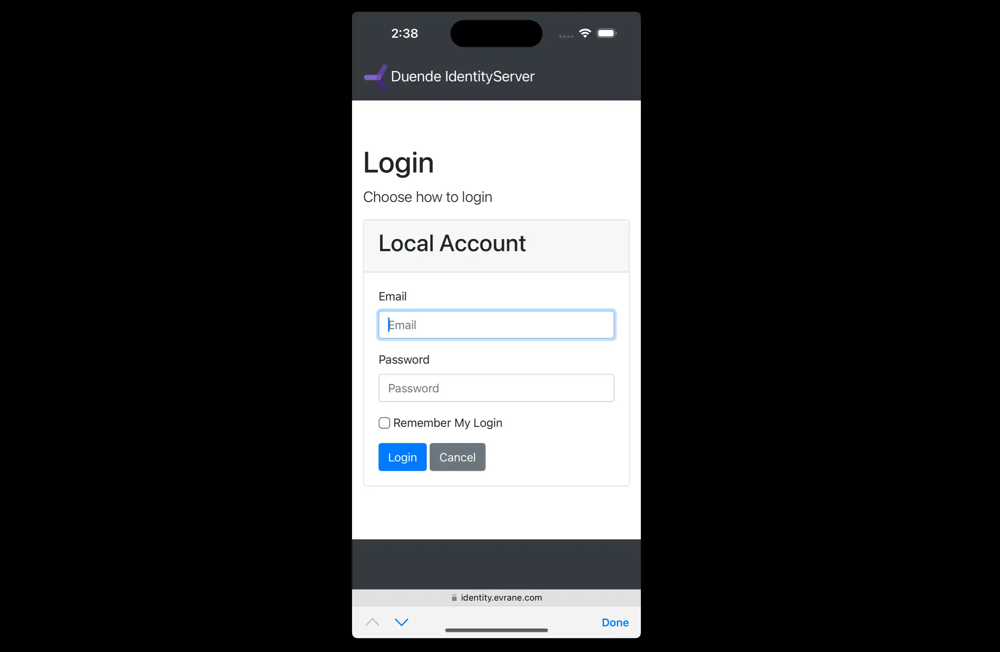
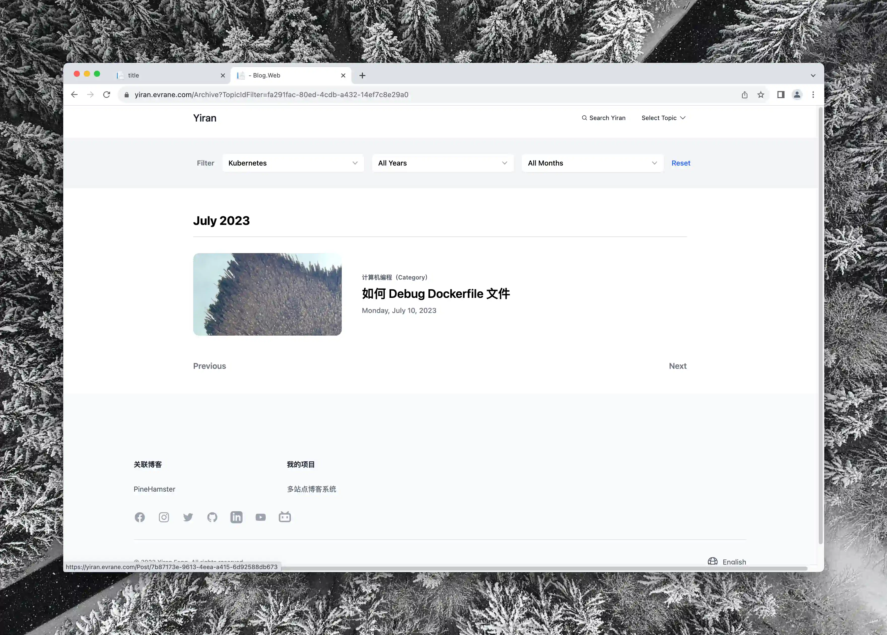

# Yiran

这是一个我业余开发的一套博客系统，它包含了一个面向管理员的博客后台系统和一个面向游客的前台系统。尽管项目是传统的后端渲染的模式，但采取了前后端分离的项目结构，两套网页系统使用RESTFUL风格的API访问API服务，不触及数据库与业务逻辑。

用以下语言浏览本文档
- 中文
- [English](./README/README.En.md)
- [日本語](./README/README.Jp.md)

## 使用到的项目

- [Tailwind CSS](https://tailwindcss.com)
- [Alpine.js](https://alpinejs.dev)
- [Entity Framework Core](https://learn.microsoft.com/en-us/ef/core/)
- [PostgreSQL](https://www.postgresql.org)
- [Docker Compose](https://docs.docker.com/compose/)

## 博客后台系统

*博客列表页，在这里可以查看或修改已经创建的所有文章*

## 基本

文章（Post），话题（Topic），类别（Category） 是该系统的三个重要元素。

所有的博客按照“话题”和“类别”两个不同维度进行分类管理，“话题”是每篇文章的主题，是要谈论的东西，围绕的重点。“类别”是文章的属性，是轻松随意的杂谈，又或是严肃的分析讨论。

*可以便利的上传本地图片*

在创建文章时，你可以自由编辑下列自定义属性

- 标题
- 副标题
- Slug(URI)
- 封面图片
- Topic
- Category
- 文章语言
- 是否公开

*可以进行代码编辑*

文章的主题像 [Notion](https://www.notion.so) 一样，由一个一个的“块”构成。

有各种不同类型的块，目前有纯文本块，图片块和代码块。

*可以编辑网站地图*

你可以自由编辑网站地图，你可以在这里新增“友情链接”的表头，随后添加你想添加的友情站点。

*可以编辑社交账户链接*

你可以添加自己的社交账户链接，将各个不同社交网站上的你链接起来。

### 多站点

*可以创建多个站点*

在后台系统中可以管理多个站点（Domain），每一个站点都是一个独立的博客系统。

每个站点都有自己的文章，话题，类别和网站地图以及社交账户链接。

### 多语言

后台系统支持多语言，你可以使用自己习惯的语言使用本系统。(目前支持中文，英文，日语）

### OIDC登录

### 移动端适配

## 前台系统

### 基本

对于在后台系统中创建的每个站点，需要单独部署相对应的前台页面

*可以便利的切换话题*

*可以查看历史文章*

### 多语言

*可以切换界面显示语言*

### 移动端适配

## 部署

详见 [deployments](./deployments/README.md)

- 部署前请配置好 OIDC 服务。
- 部署前请配置好 AWS Serverless Image Handler

### Docker Compose 方式（推荐）

请使用 deployments/evrane-blog 目录下的配置文件

### Kubernetes 方式

请参考 deployments/kubernetes 目录下的配置文件

## 视频

- [AWS Serverless Image Handler 部署教程](https://www.youtube.com/watch?v=ZpnQLg4Co9A)
- [项目介绍](https://www.youtube.com/watch?v=N76b9gZ28D8)

