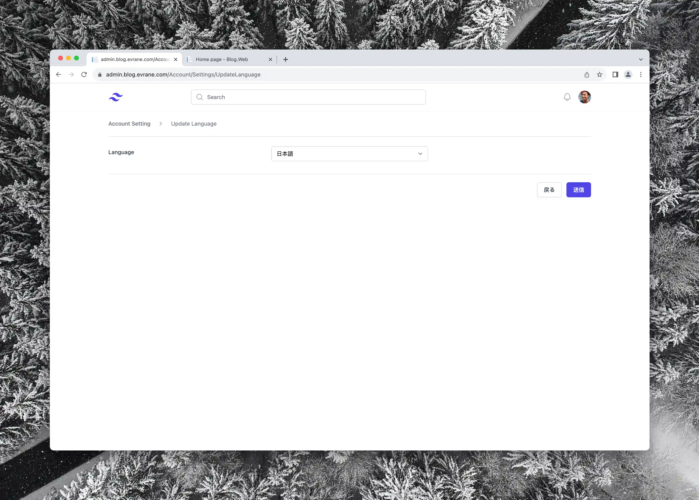

# Yiran

This is a blog system that I developed in my spare time, consisting of an admin-oriented blog backend system and a visitor-oriented frontend system. Though the project adopts the traditional server-side rendering model, it features a separated frontend and backend project structure. Both web systems use RESTful APIs to access API services without touching the database or business logic.

View this document in the following languages:
- [中文](../README.md)
- English
- [日本語](./README.Jp.md)

## Technologies Used

- [Tailwind CSS](https://tailwindcss.com)
- [Alpine.js](https://alpinejs.dev)
- [Entity Framework Core](https://learn.microsoft.com/en-us/ef/core/)
- [PostgreSQL](https://www.postgresql.org)
- [Docker Compose](https://docs.docker.com/compose/)

## Blog Backend System

*Blog list page, where you can view or modify all created articles*

## Basics

Posts, Topics, and Categories are three essential elements of this system.

All blogs are managed and categorized by two different dimensions: “Topic” and “Category.” A "Topic" is the main subject of each article and the focal point, whereas "Category" refers to the nature of the article, whether it is casual chatter or serious analysis and discussion.

*You can conveniently upload local images*

When creating an article, you can freely edit the following custom attributes:

- Title
- Subtitle
- Slug (URI)
- Cover Image
- Topic
- Category
- Language of the article
- Whether it's public

*Code editing is possible*

The main content of the article, similar to [Notion](https://www.notion.so), consists of individual "blocks."

Different types of blocks are available, including plain text blocks, image blocks, and code blocks.

*You can edit the website map*

You can freely edit the site map, where you can add a "Friendship Links" header and then add any friendly sites you wish.

*You can edit social account links*

You can add your social account links, connecting yourself across various social networking sites.

### Multi-Site

*You can create multiple sites*

Multiple sites (Domains) can be managed within the backend system, with each site operating as an independent blog system.

Each site has its own articles, topics, categories, sitemaps, and social account links.

### Multilingual

The backend system supports multiple languages, allowing you to use the system in your preferred language. (Currently supports Chinese, English, and Japanese)

### OIDC Login

### Mobile Adaptation

## Frontend System

### Basics

For each site created in the backend system, corresponding frontend pages need to be deployed separately.

*You can conveniently switch topics*

*You can view archived articles*

### Multilingual

*You can switch the display language of the interface*

### Mobile Adaptation

## Deployment

Please see [deployments](./deployments/README.md)

- Please configure the OIDC service before deployment.
- Please configure AWS Serverless Image Handler before deployment.

### Docker Compose Method (Recommended)

Please use the configuration files under the deployments/evrane-blog directory.

### Kubernetes Method

Refer to the configuration files under the deployments/kubernetes directory.

## Videos

- [AWS Serverless Image Handler Deployment Tutorial](https://www.youtube.com/watch?v=ZpnQLg4Co9A)
- [Project Introduction](https://www.youtube.com/watch?v=N76b9gZ28D8)
