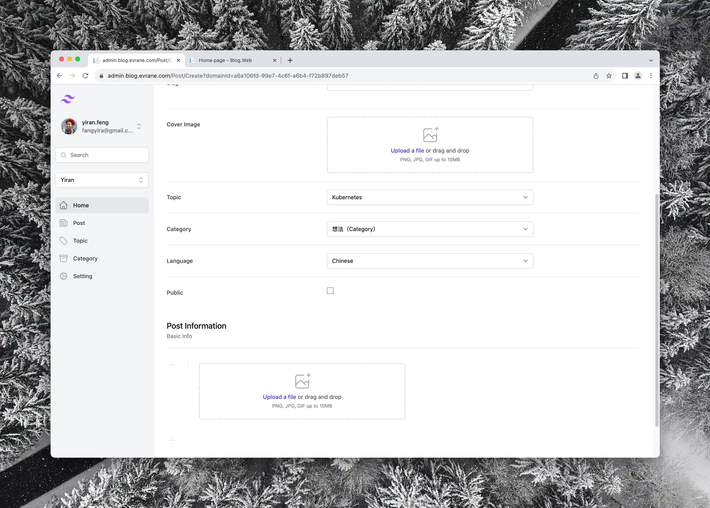
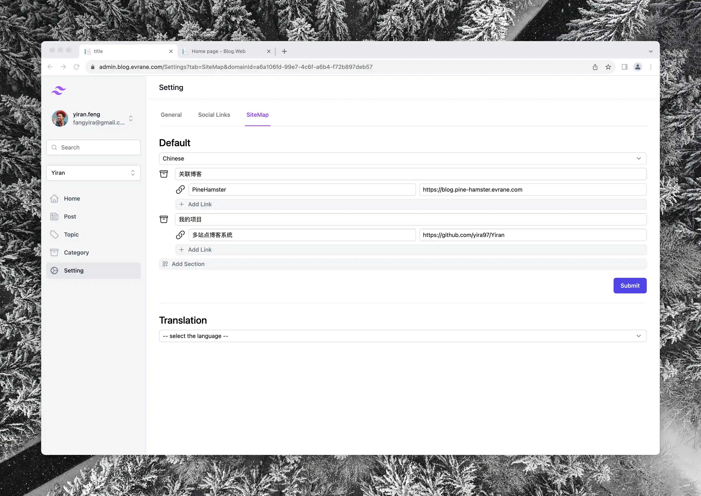
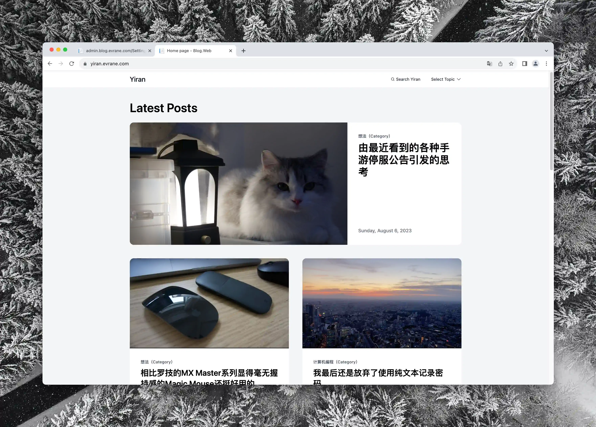
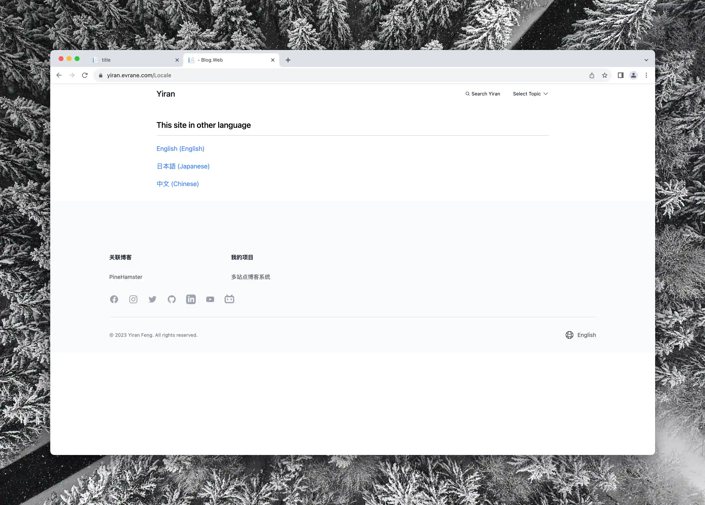

# Yiran

これは私が余暇に開発したブログシステムで、管理者向けのブログバックエンドシステムと訪問者向けのフロントエンドシステムから構成されています。プロジェクトは伝統的なサーバーサイドレンダリングモデルを採用していますが、フロントエンドとバックエンドの分離されたプロジェクト構造を特徴としています。両方のウェブシステムは、データベースやビジネスロジックに触れることなく、RESTful APIを使用してAPIサービスにアクセスします。

次の言語でこの文書を閲覧してください:
- [中文](../README.md)
- [English](./README.En.md)
- 日本語
## 使用された技術

- [Tailwind CSS](https://tailwindcss.com)
- [Alpine.js](https://alpinejs.dev)
- [Entity Framework Core](https://learn.microsoft.com/en-us/ef/core/)
- [PostgreSQL](https://www.postgresql.org)
- [Docker Compose](https://docs.docker.com/compose/)

## ブログバックエンドシステム

*ブログのリストページ。ここで作成されたすべての記事を表示または変更できます*

## 基本

記事（Post）、トピック（Topic）、カテゴリー（Category）はこのシステムの三つの重要な要素です。

すべてのブログは「トピック」と「カテゴリー」の二つの異なる次元で分類管理されます。「トピック」は各記事の主題で、焦点となるもので、「カテゴリー」は記事の性質で、カジュアルな雑談または深刻な分析や議論であるかを指します。

*便利にローカル画像をアップロードできます*

記事を作成する際、次のカスタム属性を自由に編集できます:

- タイトル
- サブタイトル
- Slug（URI）
- カバー画像
- トピック
- カテゴリー
- 記事の言語
- 公開するかどうか

*コードの編集が可能です*

記事の主題は、[Notion](https://www.notion.so)と同様に、個々の「ブロック」で構成されます。

異なるタイプのブロックがあり、現在はプレーンテキストブロック、画像ブロック、コードブロックがあります。

*ウェブサイトのマップを編集できます*

ウェブサイトのマップを自由に編集でき、友情リンクのヘッダーを追加したり、友情サイトを追加したりできます。

*ソーシャルアカウントのリンクを編集できます*

自分のソーシャルアカウントのリンクを追加し、さまざまなソーシャルネットワーキングサイト上で自分自身をつなげることができます。

### 複数サイト

*複数のサイトを作成できます*

バックエンドシステム内で複数のサイト（ドメイン）を管理でき、各サイトは独立したブログシステムとして機能します。

各サイトには独自の記事、トピック、カテゴリー、サイトマップ、ソーシャルアカウントリンクがあります。

### 多言語対応

バックエンドシステムは複数の言語をサポートし、お好みの言語でシステムを使用できます。（現在、中国語、英語、日本語をサポート）

### OIDCログイン

### モバイル対応

## フロントエンドシステム

### 基本

バックエンドシステムで作成された各サイトに対して、対応するフロントエンドページを個別にデプロイする必要があります。

*便利にトピックを切り替えることができます*

*過去の記事を見ることができます*

### 多言語対応

*インターフェイスの表示言語を切り替えることができます*

### モバイル対応

## デプロイ

詳細は [deployments](./deployments/README.md) を参照してください

- デプロイ前にOIDCサービスを設定してください。
- デプロイ前にAWS Serverless Image Handlerを設定してください。

### Docker Compose方法（推奨）

deployments/evrane-blogディレクトリの設定ファイルを使用してください。

### Kubernetes方法

deployments/kubernetesディ

レクトリの設定ファイルを参照してください。

## 動画

- [AWS Serverless Image Handler Deployment Tutorial](https://www.youtube.com/watch?v=ZpnQLg4Co9A)
- [プロジェクトの紹介](https://www.youtube.com/watch?v=N76b9gZ28D8)
